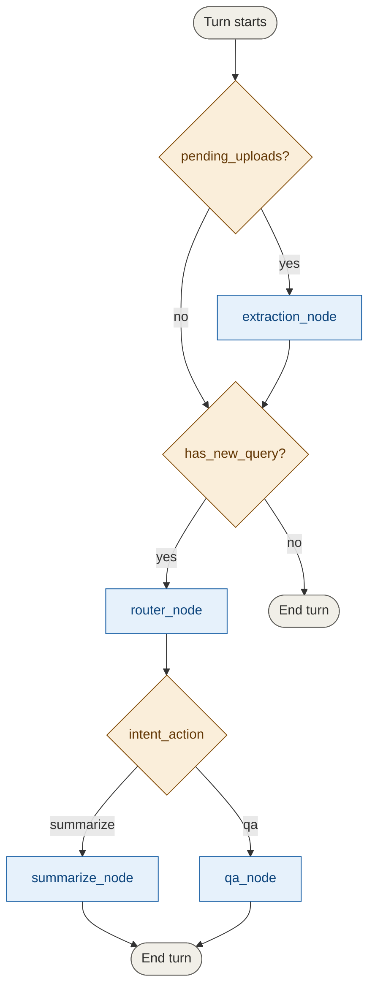

# Intelligent Form Agent

An agentic system that reads, extracts, summarizes, and answers questions
about health insurance prior-authorization forms — built on LangGraph, with
a focus on minimizing manual review through deterministic, explainable
escalation rather than blind trust in LLM confidence.

## What it does

- **Ingests** forms as images (PNG/JPG) or PDFs — a vision-capable LLM reads
  the form directly (no OCR step), producing a validated structured record.
- **Answers questions** about a single form or holistically across multiple
  forms in one conversation, with real multi-turn memory.
- **Summarizes** a form, tailored to what the user actually asked about
  rather than a generic field-by-field dump.
- **Escalates automatically** for human review when extraction is unreliable
  or a decision-critical field (patient identity, either provider, requested
  services) is missing or flagged — with a specific, human-readable reason,
  not just a flag.
- **Explains diagnosis codes** in plain language via a small verified
  ICD-10-CM reference lookup, woven directly into summaries and answers.

## Quick start

```bash
# 1. Create the environment
conda create -n form-agent python=3.11 -y
conda activate form-agent
pip install -r requirements.txt

# 2. Add your OpenAI key
echo "OPENAI_API_KEY=your-key-here" > .env

# 3. Run it
python main.py data/sample_daniel.png
```

Then just type a question at the `You:` prompt. See [Running it](#running-it)
below for the full set of options (tests, notebooks, other scripts).

## How it works

Every turn is built the same way: an interface layer detects what happened
(a message, an upload, or both) and hands a plain dict to a compiled
LangGraph graph, which decides which nodes run.



Extraction always runs before routing when a turn has both a new upload and
a new question, so the router never sees a stale form list. Conversation
memory (LangGraph's checkpointer) means a follow-up like *"what about her
DOB?"* correctly resolves against everything said earlier in the session.

For a full step-by-step trace of a turn, see
[`docs/architecture_walkthrough.md`](docs/architecture_walkthrough.md). For
the reasoning behind every design decision — including what was tried and
rejected — see [`technical_considerations.md`](technical_considerations.md).

## Running it

### The CLI

```bash
python main.py [initial_form_path ...]
```

Any file paths given at startup are ingested before the first prompt. Then:

| Input | Behavior |
|---|---|
| Plain text | Asks a question about the ingested form(s) |
| `/upload <path>` | Ingests another form mid-conversation (image or PDF) |
| `/help` | Shows available commands |
| `/quit` or `/exit` | Ends the session |

### Tests

```bash
pytest -v
```

65 tests, all offline — every LLM call is faked, so this runs without
network access or an API key. This verifies the system's own logic (schema
validation, escalation rules, routing decisions, prompt construction); it
does not verify real extraction quality — that's what the notebooks are for.

### Notebooks

Two notebooks under `notebooks/`, both making real (billed) API calls:

- **`demo_example_runs.ipynb`** — the three required demonstration runs:
  single-form Q&A, single-form summary, multi-form holistic comparison.
- **`adversarial_escalation_tests.ipynb`** — the escalation policy exercised
  against real forms with deliberately damaged fields (missing patient name,
  missing services, missing provider), plus a check that the agent doesn't
  hallucinate under user pushback.

To run them in VS Code: install the **Jupyter** extension (Microsoft), open
either notebook, click **Select Kernel** (top right) → **Python
(form-agent)**, then **Run All**. Both notebooks open with a configuration
cell — edit the file paths there if your sample filenames differ.

### Manual extraction check

```bash
python scripts/try_extraction.py data/sample_daniel.png
```

Prints the full extracted JSON for one form/PDF — useful for checking raw
extraction quality in isolation, outside the full conversational pipeline.

## Example queries and expected output

From a real session (`python main.py data/sample_daniel.png`):

```
You: Please summarize the physical therapy request for Daniel, as well as
the requested health orders for him

Assistant: The form for Daniel (DOB 03/20/1992) includes a
non-urgent request for physical therapy services. The requested services
are:

1. Open placement (44300) for aftercare following joint replacement surgery
   (diagnosis code Z47.1), scheduled from 11/20/2022 to 11/26/2022.
2. Needle catheter (44015) for Type 1 diabetes mellitus with other
   specified complication (diagnosis code E10.69), scheduled on
   11/29/2023.

The requesting provider is Elizabeth, and the service provider is
Leslie.
```

Note the plain-language diagnosis descriptions woven into the answer — that
enrichment comes from the RAG lookup described below, not from the LLM
guessing what the codes mean.

A holistic, multi-form example (same session, after uploading a second
form):

```
You: How do James' and Daniel's forms differ?

Assistant: James' and Daniel's forms differ in several ways:

1. Review Type: Daniel's form is marked as non-urgent, while James' form
   is marked as urgent.
2. Service Requests: Daniel's form includes an open placement procedure
   related to aftercare following joint replacement surgery and a needle
   catheter for Type 1 diabetes; James' form includes a surgical
   laparoscopy for subluxation and an X-ray for atheroembolism of the
   right upper extremity.
3. Providers: Daniel's requesting provider is Elizabeth (service
   provider Leslie); James' requesting provider is Jerry
   (service provider Dustin).
```

More runs, including escalation being correctly triggered on damaged forms,
are in the notebooks under `notebooks/`.

## Data & privacy

Sample form images are **not committed to this repository**, out of caution
around PII — even though the samples used were generated for testing and
are believed to be synthetic/fictitious. `data/` ships with only a
placeholder so the expected project structure is visible; the actual sample
forms used for the demonstrations and tests are shared separately.

## Creativity extensions

Beyond the core QA/summarization pipeline, this project includes:

- **PDF support**, not just images — PDFs are rendered page-by-page and
  routed through the same vision extraction path as images, including
  multi-page PDFs yielding multiple forms from one file.
- **A structural, non-confidence-dependent escalation policy** — forms are
  flagged for human review based on what's actually missing or flagged
  (patient identity, either provider, requested services), not solely on
  the LLM's own self-reported confidence, because that self-report was
  directly tested and found not to reliably correlate with correctness
  (see `technical_considerations.md`, Known Limitations).
- **RAG-enriched diagnosis codes**, verified against real ICD-10-CM sources
  rather than generated from memory, woven directly into summaries and
  answers.
- **Real-data adversarial testing** — an entire notebook exercising the
  escalation policy against actual damaged forms (blurred/blocked fields),
  not just synthetic test fixtures.
- **A documented, unbuilt improvement path** for confidence calibration — a
  second-pass verification architecture was designed and evaluated but
  deliberately not built, with the reasoning for that call recorded rather
  than left as an unexplained gap.

## Project structure

```
.
├── main.py                  # CLI entry point
├── requirements.txt
├── .env                     # OPENAI_API_KEY (not committed)
├── data/                    # sample forms (see Data & privacy above)
├── docs/
│   └── architecture_walkthrough.md
├── notebooks/
│   ├── demo_example_runs.ipynb
│   └── adversarial_escalation_tests.ipynb
├── scripts/
│   └── try_extraction.py
├── src/
│   ├── schemas.py           # PriorAuthForm, AgentState
│   ├── graph.py             # the compiled LangGraph agent
│   ├── turn_input.py        # interface layer: builds per-turn state updates
│   ├── icd_lookup.py        # ICD-10-CM RAG lookup
│   └── nodes/
│       ├── extraction.py
│       ├── router.py
│       ├── summarization.py
│       ├── qa.py
│       └── shared.py        # helpers shared by router/summarize/qa
├── tests/                   # 65 tests, no network/API key required
└── technical_considerations.md
```

## Known limitations

Briefly (full detail, with evidence, in `technical_considerations.md`):

- LLM self-reported extraction confidence does not reliably correlate with
  actual correctness — the escalation policy is built to not depend on it
  alone.
- The same form can produce slightly different extraction results across
  separate runs, even at `temperature=0`.
- ICD code enrichment covers the codes present in this project's sample
  forms, not the full official code set — the scaling path (hybrid exact
  match + embedding search) is documented but not built.

## Further documentation

- [`docs/architecture_walkthrough.md`](docs/architecture_walkthrough.md) —
  how a single turn flows through the system, step by step.
- [`technical_considerations.md`](technical_considerations.md) — every
  design decision, the alternatives considered, and the reasoning behind
  each choice.
