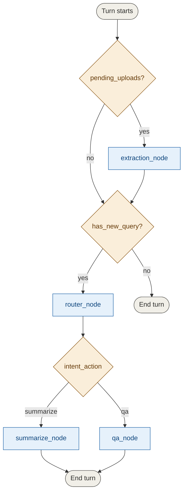
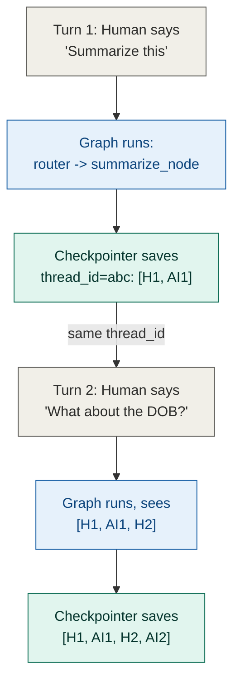

# How a turn actually flows through the system

This is a step-by-step trace of what happens between typing something
into `main.py` and seeing a response — useful for understanding the
codebase, not required reading to *use* the agent. For the reasoning
behind individual design decisions, see `technical_considerations.md`
instead; this doc is about *how*, that one is about *why*.

## The three layers

The system is built in three layers that don't know about each other's
internals:

1. **Interface layer** (`main.py`, `turn_input.py`) — detects that
   something happened (a message, an upload, both) and turns it into a
   plain dict. No agent reasoning here at all.
2. **Graph layer** (`graph.py`) — decides which nodes run, in what
   order, based only on what's in that dict and the persisted state.
3. **Node layer** (`src/nodes/*.py`) — does the actual work: extraction,
   routing, summarizing, answering.

## Startup

```python
graph = build_graph()
config = {"configurable": {"thread_id": str(uuid.uuid4())}}
```

`build_graph()` compiles the `StateGraph` once, with a checkpointer
attached. `config` is generated once per process run, holding a random
`thread_id`. Every `graph.invoke()` call for the rest of the session
reuses this exact `config` — that's the entire mechanism that ties a
session's turns into one conversation. A second terminal running
`main.py` gets its own random `thread_id` and starts a completely
separate, empty conversation.

## One turn, traced end to end

Every turn — startup files, a typed question, or `/upload` mid-session —
goes through the same two lines:

```python
update = build_turn_update(user_text=..., uploaded_files=...)
result = graph.invoke(update, config=config)
```

`build_turn_update()` is a pure function with no graph awareness. It
returns a small dict, and critically, it **always** includes
`has_new_query` — explicitly `True` or `False`, never omitted — because
that's the one signal the graph can't reliably derive from `messages`
itself (see below).

### Inside `graph.invoke()`



Extraction always runs before the router when a turn has both a new
upload and a new question — sequential, not parallel, so the router
always sees fully up-to-date `forms` rather than racing extraction.

- **Upload-only turn** (e.g. a startup file, or `/upload` with no
  question): `pending_uploads` is set, `has_new_query` is `False`.
  `extraction_node` runs, ingests the file(s), and since there's no
  question this turn, the graph ends there. The `response` you see is
  `extraction_node`'s own ingestion summary — nothing "answered"
  anything, because nothing was asked.
- **Question-only turn**: no `pending_uploads`, `has_new_query` is
  `True`. Straight to `router_node`, which reads the latest message
  plus the current form list and decides `summarize` or `qa` — the
  actual routing decision is a real (cheap) LLM call, not a keyword
  match.
- **Upload + question in the same turn**: both run, extraction first,
  guaranteeing the router (and whichever node it hands off to) sees the
  form that was *just* uploaded, not a stale list from before this turn
  started.

### Why `has_new_query` exists at all

`messages` accumulates forever via LangGraph's `add_messages` reducer —
it never shrinks. From the second turn onward, `messages` is *always*
non-empty, whether or not this particular turn included a new question.
Checking `bool(state["messages"])` to decide "should the query pipeline
run this turn" would therefore be wrong from turn two onward — it can't
tell "history exists" apart from "something new arrived this turn."
`has_new_query` is the explicit, always-set flag that makes that
distinction reliably, rather than the graph trying to infer it.

### Multi-turn memory, concretely



Two separate things make a follow-up question like "what about the
DOB?" actually work:

1. **Storage** — the checkpointer + `add_messages` reducer persist the
   full history across separate `invoke()` calls, keyed by `thread_id`.
2. **Usage** — `summarize_node`/`qa_node` actually read that history
   (via `conversation_history_text()`) and include it in their prompt,
   not just the newest message. Storage without usage would mean the
   history exists but the LLM never sees it — both pieces are required.

## Where escalation surfaces

`extraction_node` never blocks anything — a flagged form still gets
summarized or answered about normally. What changes is that
`summarize_node`/`qa_node` include a `FLAGGED` marker (via
`form_context()`) for any form with open `escalation_reasons()`, so the
LLM can hedge specific claims in its answer rather than presenting
uncertain data as fact. Separately, `main.py` prints
`[flagged for review: ...]` directly from `result["needs_escalation"]`
after any turn — independent of whether the LLM chose to mention it in
its own answer.

## File map

| File | Layer | Role |
|---|---|---|
| `main.py` | Interface | Collects input, prints output. No reasoning. |
| `turn_input.py` | Interface | Builds the per-turn state update dict. |
| `graph.py` | Graph | Wires nodes together, decides execution order. |
| `schemas.py` | Shared | `AgentState`, `PriorAuthForm`, and their validation/escalation logic. |
| `nodes/extraction.py` | Node | Turns a file into validated form(s). |
| `nodes/router.py` | Node | Classifies action + scope for a query. |
| `nodes/shared.py` | Node | Helpers used by more than one node (scope resolution, prompt context, history formatting). |
| `nodes/summarization.py` | Node | Produces a summary for 1..N forms. |
| `nodes/qa.py` | Node | Answers a question about 1..N forms. |
